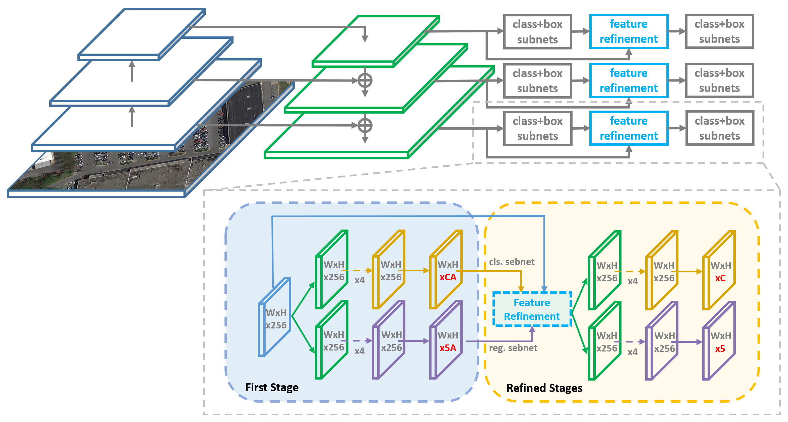

# R<sup>3</sup>Det: Refined Single-Stage Detector with Feature Refinement for Rotating Object

## Abstract
[R<sup>3</sup>Det](https://arxiv.org/abs/1908.05612) and [R<sup>3</sup>Det++](https://arxiv.org/abs/2004.13316) are based on [Focal Loss for Dense Object Detection](https://arxiv.org/pdf/1708.02002.pdf), and it is completed by [YangXue](https://yangxue0827.github.io/).

Techniques:     
- [x] [ResNet](https://arxiv.org/abs/1512.03385), [MobileNetV2](https://arxiv.org/abs/1801.04381), [EfficientNet](https://arxiv.org/abs/1905.11946)
- [x] [Feature Refinement Module (FRM)](https://arxiv.org/abs/1908.05612)
- [x] [Instance Level Denoising (InLD)](https://arxiv.org/abs/2004.13316)
- [x] [IoU-Smooth L1 Loss](https://arxiv.org/abs/1811.07126)
- [x] [Circular Smooth Label (CSL)](https://arxiv.org/abs/2003.05597)
- [x] Anchor Free (one anchor per feature point)
- [x] [mmdetection version](https://github.com/SJTU-Thinklab-Det/r3det-on-mmdetection) is released

## Pipeline


## Performance
More results and trained models are available in the [MODEL_ZOO.md](MODEL_ZOO.md).
### DOTA1.0
### R<sup>3</sup>Det
| Model |    Backbone    |    Training data    |    Val data    |    mAP   | Model Link | Anchor | Reg. Loss| Angle Range | lr schd | Data Augmentation | GPU | Image/GPU | Configs |      
|:------------:|:------------:|:------------:|:---------:|:-----------:|:----------:|:-----------:|:-----------:|:---------:|:---------:|:---------:|:---------:|:---------:|:---------:|    
| [R<sup>3</sup>Det](https://arxiv.org/abs/1908.05612) | ResNet50_v1d 600->800 | DOTA1.0 trainval | DOTA1.0 test | 66.31 | [model](https://drive.google.com/file/d/1cBKxcePQFIv3yKQTOVw598nb-IwUXJV_/view?usp=sharing)  | H + R | smooth L1 | 90 | 2x | No | 4X GeForce RTX 2080 Ti | 1 | [cfgs_res50_dota_r3det_v1.py](./libs/configs/DOTA1.0/r3det/cfgs_res50_dota_r3det_v1.py) |
| [R<sup>3</sup>Det*](https://arxiv.org/abs/1908.05612) | ResNet50_v1d 600->800 | DOTA1.0 trainval | DOTA1.0 test | 67.29 (67.66) | [model](https://drive.google.com/file/d/1RfnLyNgy5pwVuCvOmGao0ytC5jfSRQjx/view?usp=sharing) | H + R | smooth L1 | 90 | 2x | No | 2X GeForce RTX 2080 Ti | 1 | [cfgs_res50_dota_r3det_v2.py](./libs/configs/DOTA1.0/r3det/cfgs_res50_dota_r3det_v2.py) |
| [R<sup>3</sup>Det*](https://arxiv.org/abs/1908.05612) | ResNet50_v1d 600->800 | DOTA1.0 trainval | DOTA1.0 test | 69.50 | - | H + R | [**iou-smooth L1 [1-exp(1-x)]**](https://arxiv.org/abs/1811.07126) | 90 | 2x | No | 4X GeForce RTX 2080 Ti | 1 | [cfgs_res50_dota_r3det_v12.py](./libs/configs/DOTA1.0/r3det/cfgs_res50_dota_r3det_v12.py) |

### R<sup>3</sup>Det++
| Model |    Backbone    |    Training data    |    Val data    |    mAP   | Model Link | InLD | Anchor | Reg. Loss| Angle Range | lr schd | Data Augmentation | GPU | Image/GPU | Configs |      
|:------------:|:------------:|:------------:|:---------:|:-----------:|:----------:|:-----------:|:-----------:|:-----------:|:---------:|:---------:|:---------:|:---------:|:---------:|:---------:|    
| **[R<sup>3</sup>Det++](https://yangxue0827.github.io/SCRDet++.html)** | ResNet50_v1d 600->800 | DOTA1.0 trainval | DOTA1.0 test | 69.07 | - | {4,4,3,2,2} | H + R | smooth L1 | 90 | 2x | No | 4X GeForce RTX 2080 Ti | 1 | [cfgs_res50_dota_r3det_plusplus_v2.py](./libs/configs/DOTA1.0/r3det_plusplus/cfgs_res50_dota_r3det_plusplus_v2.py) |
| [R<sup>3</sup>Det++](https://yangxue0827.github.io/SCRDet++.html) | ResNet50_v1d 600->800 | DOTA1.0 trainval | DOTA1.0 test | 69.81 | [model](https://drive.google.com/file/d/12_7-7ihl5Nozvja6aQjLEzxY8RUy0px5/view?usp=sharing) | **{1,1,1,1,1}** | H + R | smooth L1 | 90 | 2x | No | 4X GeForce RTX 2080 Ti | 1 | [cfgs_res50_dota_r3det_plusplus_v3.py](./libs/configs/DOTA1.0/r3det_plusplus/cfgs_res50_dota_r3det_plusplus_v3.py) |
| [R<sup>3</sup>Det++](https://yangxue0827.github.io/SCRDet++.html) | ResNet50_v1d 600->800 | DOTA1.0 trainval | DOTA1.0 test | 70.08 | - | {1,1,1,1,1} | H + R | [**iou-smooth L1 [1-exp(1-x)]**](https://arxiv.org/abs/1811.07126) | 90 | 2x | No | 4X GeForce RTX 2080 Ti | 1 | [cfgs_res50_dota_r3det_plusplus_v9.py](./libs/configs/DOTA1.0/r3det_plusplus/cfgs_res50_dota_r3det_plusplus_v9.py) |

### Visualization


## My Development Environment
**docker images: docker pull yangxue2docker/yx-tf-det:tensorflow1.13.1-cuda10-gpu-py3**      
1、python3.5 (anaconda recommend)               
2、cuda 10.0                     
3、[opencv(cv2)](https://pypi.org/project/opencv-python/)       
4、[tfplot 0.2.0](https://github.com/wookayin/tensorflow-plot) (optional)            
5、tensorflow-gpu 1.13                              

## Download Model
### Pretrain weights
1、Please download [resnet50_v1](http://download.tensorflow.org/models/resnet_v1_50_2016_08_28.tar.gz), [resnet101_v1](http://download.tensorflow.org/models/resnet_v1_101_2016_08_28.tar.gz), [resnet152_v1](http://download.tensorflow.org/models/resnet_v1_152_2016_08_28.tar.gz), [efficientnet](https://github.com/tensorflow/tpu/tree/master/models/official/efficientnet), [mobilenet_v2](https://storage.googleapis.com/mobilenet_v2/checkpoints/mobilenet_v2_1.0_224.tgz) pre-trained models on Imagenet, put it to data/pretrained_weights.       
2、**(Recommend in this repo)** Or you can choose to use a better backbone (resnet_v1d), refer to [gluon2TF](https://github.com/yangJirui/gluon2TF).    
* [Baidu Drive](https://pan.baidu.com/s/1GpqKg0dOaaWmwshvv1qWGg), password: 5ht9.          
* [Google Drive](https://drive.google.com/drive/folders/1BM8ffn1WnsRRb5RcuAcyJAHX8NS2M1Gz?usp=sharing)      

## Compile
```  
cd $PATH_ROOT/libs/box_utils/cython_utils
python setup.py build_ext --inplace (or make)

cd $PATH_ROOT/libs/box_utils/
python setup.py build_ext --inplace
```

## Train

1、If you want to train your own data, please note:  
```     
(1) Modify parameters (such as CLASS_NUM, DATASET_NAME, VERSION, etc.) in $PATH_ROOT/libs/configs/cfgs.py
(2) Add category information in $PATH_ROOT/libs/label_name_dict/lable_dict.py     
(3) Add data_name to $PATH_ROOT/data/io/read_tfrecord_multi_gpu.py  
```     

2、Make tfrecord     
For DOTA dataset:      
```  
cd $PATH_ROOT\data\io\DOTA
python data_crop.py
```  

```  
cd $PATH_ROOT/data/io/  
python convert_data_to_tfrecord.py --VOC_dir='/PATH/TO/DOTA/' 
                                   --xml_dir='labeltxt'
                                   --image_dir='images'
                                   --save_name='train' 
                                   --img_format='.png' 
                                   --dataset='DOTA'
```      

3、Multi-gpu train
```  
cd $PATH_ROOT/tools
python multi_gpu_train_r3det.py
```

## Eval
```  
cd $PATH_ROOT/tools
python test_dota_r3det.py --test_dir='/PATH/TO/IMAGES/'  
                          --gpus=0,1,2,3,4,5,6,7          
``` 

## Tensorboard
```  
cd $PATH_ROOT/output/summary
tensorboard --logdir=.
``` 


## Citation

If this is useful for your research, please consider cite.

```
@article{yang2020arbitrary,
    title={Arbitrary-Oriented Object Detection with Circular Smooth Label},
    author={Yang, Xue and Yan, Junchi},
    journal={arXiv preprint arXiv:2003.05597},
    year={2020}
}

@article{yang2019r3det,
    title={R3Det: Refined Single-Stage Detector with Feature Refinement for Rotating Object},
    author={Yang, Xue and Liu, Qingqing and Yan, Junchi and Li, Ang and Zhang, Zhiqiang and Yu, Gang},
    journal={arXiv preprint arXiv:1908.05612},
    year={2019}
}

@article{yang2020scrdet++,
    title={SCRDet++: Detecting Small, Cluttered and Rotated Objects via Instance-Level Feature Denoising and Rotation Loss Smoothing},
    author={Yang, Xue and Yan, Junchi and Yang, Xiaokang and Tang, Jin and Liao, Wenglong and He, Tao},
    journal={arXiv preprint arXiv:2004.13316},
    year={2020}
}

@inproceedings{yang2019scrdet,
    title={SCRDet: Towards more robust detection for small, cluttered and rotated objects},
    author={Yang, Xue and Yang, Jirui and Yan, Junchi and Zhang, Yue and Zhang, Tengfei and Guo, Zhi and Sun, Xian and Fu, Kun},
    booktitle={Proceedings of the IEEE International Conference on Computer Vision (ICCV)},
    pages={8232--8241},
    year={2019}
}

@inproceedings{xia2018dota,
    title={DOTA: A large-scale dataset for object detection in aerial images},
    author={Xia, Gui-Song and Bai, Xiang and Ding, Jian and Zhu, Zhen and Belongie, Serge and Luo, Jiebo and Datcu, Mihai and Pelillo, Marcello and Zhang, Liangpei},
    booktitle={Proceedings of the IEEE Conference on Computer Vision and Pattern Recognition (CVPR)},
    pages={3974--3983},
    year={2018}
}

```

## Reference
1、https://github.com/endernewton/tf-faster-rcnn   
2、https://github.com/zengarden/light_head_rcnn   
3、https://github.com/tensorflow/models/tree/master/research/object_detection    
4、https://github.com/fizyr/keras-retinanet     


